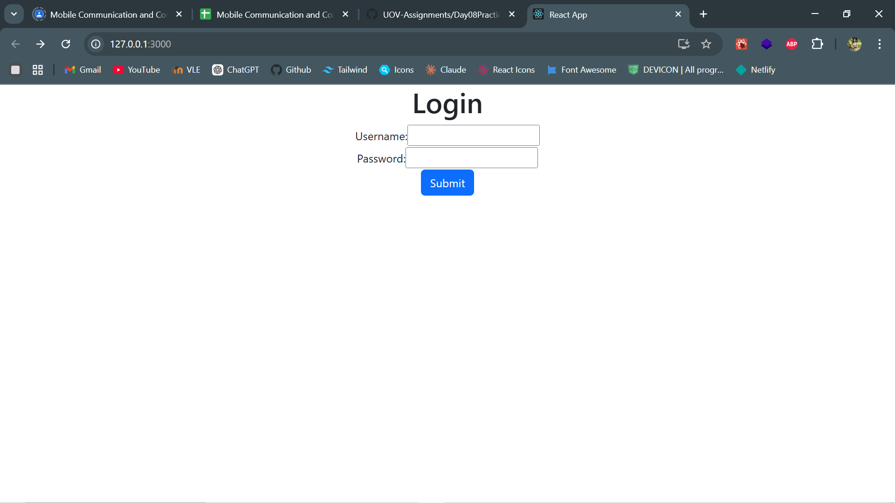
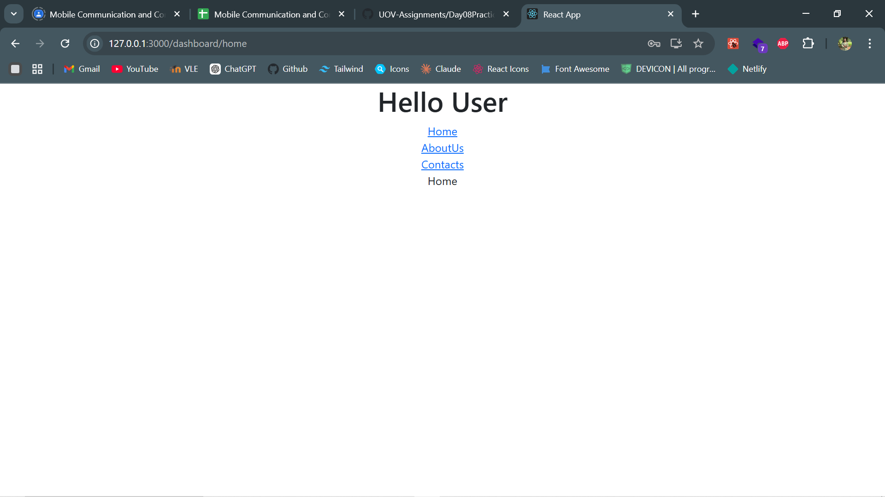

# Day08Practical

# React Application: Login & Dashboard

🌟 **Overview**  
This project demonstrates a lightweight React application featuring a secure login page and a dynamic dashboard. The application allows users to navigate between "Home," "About," and "Contact" pages, showcasing React Router's capabilities alongside fundamental web development practices.

---

💡 **Key Features**

- **Login Authentication**: Simulated with hardcoded credentials for easy testing.
- **Dashboard Navigation**: Clean, user-friendly links to core pages.
- **Responsive Styling**: Custom responsive design using CSS for a polished look.
- **Error Handling**: Displays error messages for invalid login attempts.
- **React Router DOM**: Enables seamless client-side navigation.

---

⚙️ **How to Run the Project**

1. **Clone the Repository**:  
   Clone the project repository to your local machine using the following command:

   ```bash
   git clone https://github.com/UOV-Assignments/Day08Practical.git
   cd day08practical

   ```

2. **Install Dependencies**:

   ```bash
   npm install

   ```

3. **Start the Application**:

   ```bash
   npm start

   ```

4. **Access the Applicationn**:  
   Open your browser and go to: http://localhost:3000

5. **Access the Applicationn**:  
   Test the Login:
   - Username: admin
   - Password: admin

🎯 **Features in Action**

**Login Page:**

A clean, responsive login interface.
Shows error messages for incorrect credentials.

**Dashboard:**

After logging in, users can explore:

- **Home Page:** A customizable welcome page.
- **About Page:** Details about the app or its creators.
- **Contact Page:** Contact information or a feedback form.

**Outputs**



